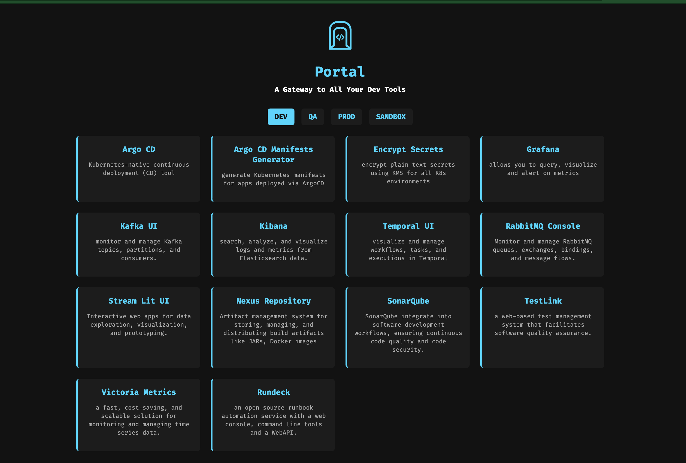
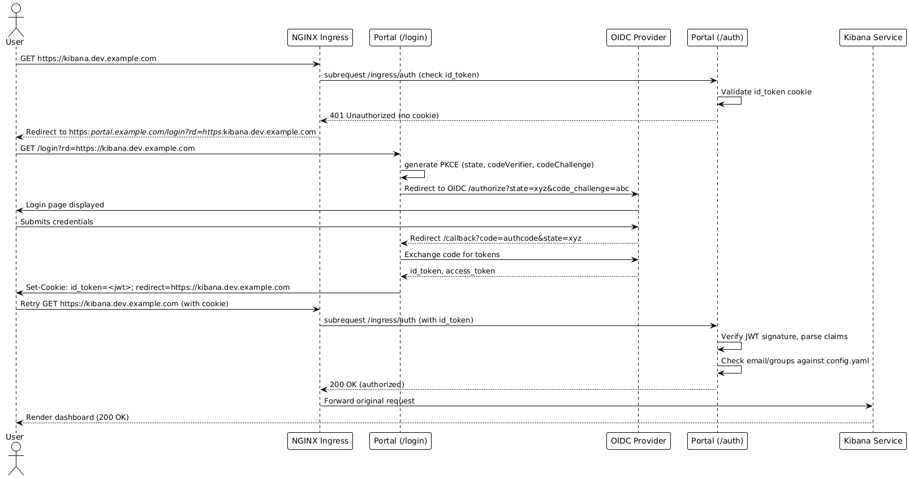

# Portal (SSO & Access Control Platform)

## Overview

The **Portal** is a lightweight **SSO & access management gateway** for internal tools across environments (Dev, QA, Prod).  
It provides **centralized login, RBAC, and discovery** of all engineering dashboards and services, powered by:

- **Dex (OIDC)** identity provider  
- **Go Portal** stateless SSO and authorization logic  
- **Ingress-NGINX external OAuth** seamless authentication enforcement for internal apps  

### Users authenticate once and gain access to all authorized apps without remembering ingress URLs.
---

### How it looks:



## How It Works

1. **Dex** authenticates users via Google Workspace (OIDC).  
2. **Go Portal** validates tokens, checks groups, and exposes `/auth` and `/login`.  
3. **Ingress-NGINX** calls `/auth` before serving any app, forwarding valid identity headers.  
4. Each app then trusts the Ingress identity headers.  
---

## Components

| Component | Description |
|------------|--------------|
| **Dex** | Central OIDC provider for login and identity |
| **Go Portal** | Validates sessions, enforces group-based RBAC, serves app directory |
| **Ingress-NGINX** | Enforces external OAuth using the portal’s `/auth` endpoint |
| **Internal Apps** | Protected dashboards & tools (Argo CD, Kafka UI, Grafana, etc.) |

---

## Configuration Example (`config.yaml`)

```yaml
apps:
  - name: Argo CD
    description: Kubernetes-native continuous deployment (CD) tool
    env:
      - dev:
          upstream: https://internal-argocd.dev.yourdomain.com
          groups:
            - "infraops@yourdomain.com"
            - "engineering@yourdomain.com"
          emails:
            - "alice@yourdomain.com"
            - "bob@yourdomain.com"
      - qa:
          upstream: https://internal-argocd.qa.yourdomain.com
          groups:
            - "infraops@yourdomain.com"
            - "engineering@yourdomain.com"
      - prod:
          upstream: https://int-argocd.prod.yourdomain.com
          groups:
            - "infraops@yourdomain.com"
```

## Ingress Integration Example
Attach these annotations to any internal app’s Ingress:
```
apiVersion: networking.k8s.io/v1
kind: Ingress
metadata:
  annotations:
    nginx.ingress.kubernetes.io/auth-response-headers: Set-Cookie, X-Portal-Claim-Name, X-Portal-Claim-Email, X-Portal-Claim-Groups
    nginx.ingress.kubernetes.io/auth-signin: https://portal.yourdomain.com/login
    nginx.ingress.kubernetes.io/auth-url: https://portal.yourdomain.com/auth
  name: rundeck
  namespace: rundeck
spec:
  ingressClassName: nginx
  rules:
  - host: int-rundeck.yourdomain.com
    http:
      paths:
      - backend:
          service:
            name: rundeck-backend
            port:
              name: rundeck
        path: /
        pathType: ImplementationSpecific
  ...
  ...
  ...
nginx.ingress.kubernetes.io/auth-response-headers: "Set-Cookie" # Also provides "X-Portal-Jwt-Assertion, X-Portal-Claim-Email,X-Portal-Claim-Groups,X-Portal-Claim-Name"
nginx.ingress.kubernetes.io/auth-signin: "https://portal.yourdomain.com/login"
nginx.ingress.kubernetes.io/auth-url: "https://portal.yourdomain.com/ingress/auth"

# optional if you want to enable jwt based auto user login in your app (example: in Grafana, Rundeck)
nginx.ingress.kubernetes.io/configuration-snippet: |
  proxy_set_header X-User-Email $auth_resp_x-portal-claim-email;
  proxy_set_header X-User-Name $auth_resp_x-portal-claim-name;
  proxy_set_header X-User-Groups $auth_resp_x-portal-claim-groups;
  proxy_set_header X-JWT-Assertion $auth_resp_x-portal-jwt-assertion;
```

## Claim Headers in Response 
The Claims Headers returned after authorization allows you to pass specific user session data to upstream applications as HTTP request headers.
1. `X-Portal-Jwt-Assertion`
2. `X-Portal-Claim-{Email|Name|Groups}`


### Auth flow:
/ingress/auth → returns 200 OK if user is logged in, 401 if not.
/login → redirects user to Dex for authentication.

| Component         | Role                      | Responsibility                                                                  |
| ----------------- | ------------------------- | ------------------------------------------------------------------------------- |
| **Dex**           | 🔐 Authentication         | Verifies user identity via OIDC / Google Workspace                              |
| **Go Portal**     | 🔒 Authorization          | Determines *which apps/environments* the user can access based on `config.yaml` |
| **Ingress-NGINX** | 🚪 Enforcement            | Forwards requests to `/ingress/auth`; only routes if the user is authorized     |
| **Internal Apps** | 🧰 Target Systems         | Actual dashboards & tools (ArgoCD, Grafana, Kafka UI, etc.)                     |

### Sequence Diagram:

